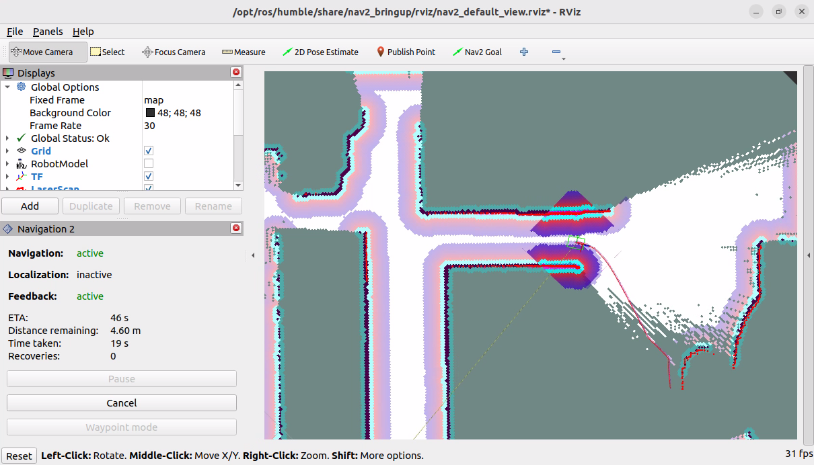

### 4.5.10 自主探索SLAM {#459-自主探索slam}

导航需要依赖于地图与定位，例如在上一节**4.5.9 导航功能集成**中，导航实现时就是以launch文件的方式集成了**4.4 定位AMCL**一节中的定位功能，而机器人SLAM时，也是发布地图数据与定位信息的，所以导航时也可以不借助于amcl而是直接与SLAM结合，达到自主探索的SLAM效果。

#### 1.编写launch文件 {#1编写launch文件}

在功能包mycar\_navigation2的launch目录下新建名为`auto_slam.launch.py`的launch文件，并输入如下内容：

```py
import os

from ament_index_python.packages import get_package_share_directory

from launch import LaunchDescription
from launch.actions import IncludeLaunchDescription
from launch.launch_description_sources import PythonLaunchDescriptionSource


def generate_launch_description():

    slam_pkg = get_package_share_directory("mycar_slam_slam_toolbox")
    nav2_pkg = get_package_share_directory("mycar_navigation2")

    slam_launch = IncludeLaunchDescription(
        PythonLaunchDescriptionSource(os.path.join(slam_pkg,'launch',
                                                    'online_async_launch.py'))
        )

    nav2_launch = IncludeLaunchDescription(
        PythonLaunchDescriptionSource(os.path.join(nav2_pkg,'launch', 
                                                    'nav2.launch.py'))
        )

    ld = LaunchDescription()
    ld.add_action(slam_launch)
    ld.add_action(nav2_launch)
    return ld
```

#### 2.编译 {#2编译}

终端中进入当前工作空间，编译功能包：

```
colcon build --packages-select mycar_navigation2
```

#### 3.执行 {#3执行}

（1）请先调用如下指令启动仿真环境：

```
. install/setup.bash
ros2 launch stage_ros2 my_house.launch.py
```

（2）然后在终端下进入当前工作空间，输入如下指令启动自主SLAM功能：

```
. install/setup.bash
ros2 launch mycar_navigation2 auto_slam.launch.py
```

（3）启动rviz2，加载`/opt/ros/humble/share/nav2_bringup/rviz`下的`nav2_default_view.rviz`文件，再通过菜单栏的`Nav2 Goal`设置目标点，机器人就可以自动导航至目标点，并且导航中还会实现建图的功能。



